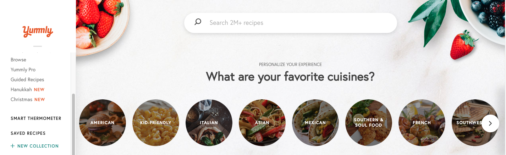
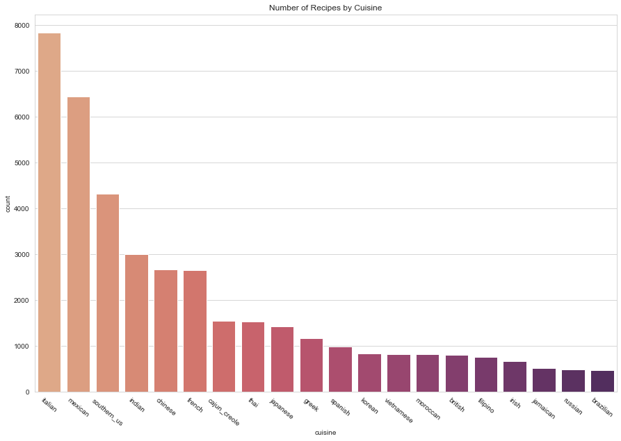
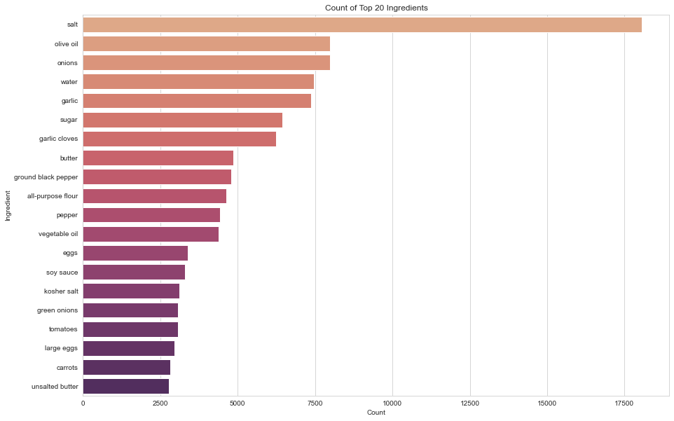
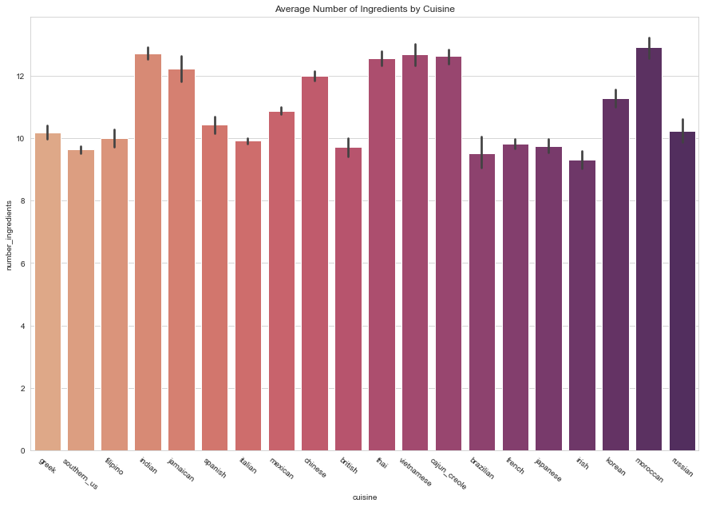
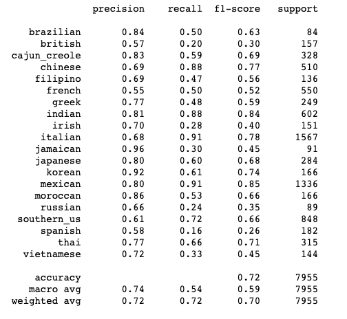
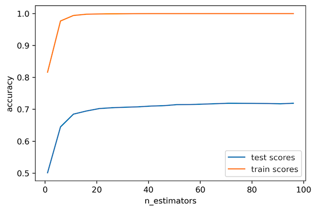

# Cuisine Classifier

## Introduction
Food is seen as a gateway to understanding different cultures and learning more about various regions of the world. While certain recipes are distinct to
specific regions, many recipes are not constrained to its boundaries as varying regions of the world share similarities in its cuisines. Machine learning can
help to uncover these similarities along with analyzing what makes each cuisine unique. This final project was completed for INFO 656 Machine Learning at Pratt
Institute in Fall 2020.

### Problem:
With the rise of food related apps and websites, understanding different cuisines and being able to recognize it is crucial. Whether the service is to streamline
food delivery or add to a growing collection of publicly available recipes, apps and websites need to be able to read and recognize numerous ingredients and
correctly classify its associated cuisines. The ultimate goal then is to be able to classify a cuisine given its ingredients. 

### Techniques and Expected Output:
A supervised multi-label classification using a variety of models will be used for comparison and to determine which model works best for this problem. The three
models selected were logistic regression, decision tree classifier, and random forest classifier. The expected output would be a classifier that can label
cuisines given a set of ingredients for a recipe.

### Dataset: 
<figure>
  
</figure>

Yummly, a mobile app and website that provides personalized recipe recommendations and searches, supplied a dataset of various recipes and its associated
ingredients. More information about the dataset is available at: https://www.yummly.com/insights/understanding-cuisines

### Process:
The general process towards creating the expected output of a cuisine classifier was the following:
- Obtain dataset from Yummly and clean and prepare data for preliminary exploratory analysis
- Conduct an exploratory data analysis and create accompanying visualizations in order to get an overview of the dataset
- Prepare data for modeling by separating features (ingredients) from dataset and splitting into train and test sets
- Fit data to each model and report accuracy scores

## Analysis & Visualizations

<figure>
  
</figure>

From counting the number of recipes represented and visualizing it in a bar graph, we can see that Italian cuisine is well represented in the dataset. This could
indicate its popularity or its mere abundance of recipes that are available. The perspective from which this dataset was compiled and collected could also serve
as an explanation. As Yummly is based in the United States, it may be reflecting American tastes and choices in cuisine.

<figure>
  
  <figcaption>Original depictions of findings 1 and 2.</figcaption>
</figure>

By obtaining the top 20 ingredients, we can see that salt is the most common ingredient. It is also interesting to note that these commonly used ingredients are
ones that can be found in almost all cuisines, indicating its universality and how it is not constrained by boundaries. The only exception to this would be soy
sauce, which is mainly an Asian ingredient.

<figure>
  
</figure>

Tying it together, my last visualization aimed to explore the average number of ingredients in a recipe by each cuisine. The cuisines that had on average over 12
ingredients in a recipe were Indian, Jamaican, Thai, Vietnamese, Cajun-Creole, and Moroccan. These cuisines typically include many spices, which may have
attributed to higher average ingredient counts compared to other cuisines.

## Modeling Results

After fitting and training my data, the results from each model are as follows:

| Model      | Accuracy Score|
| ----------- | ----------- |
| Logistic Regression      | 78% |
| Decision Tree Classifier   | 60%|
| Random Forest Classifier   | 72%|

The classification report for the random forest classifier is as follows:

<figure>
  
</figure>

When plotting accuracy results for the random forest classifier, we can see that the data has been overfitting, which indicates that it is only performing well
on the trained dataset that it has been given.

<figure>
  
</figure>

## Conclusion & Next Steps
Ultimately, the logistic regression model performed the best out of the three at 78%. However, there is still room for improvement and there also arises the
issue of overfitting data, which is when the training set knows the model data too well and cannot apply it it new data. Some potential next steps to address
this issue of overfitting and to improve accuracy scores could be resampling data or using a different model, such as a neural network.

Once such issues get resolved and accuracy improves, a cuisine classifier has the potential to add more value to the many apps, websites, and services that are
within the food and restaurant industry. As personalization features are becoming more common, a cuisine classifier can be a way for companies to gain new
customers or users to their platform.

